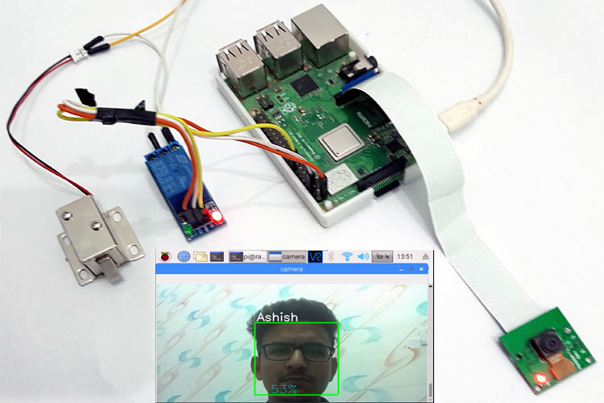

# Face-Door-Unlock

A Realtime face recognition and door unlock system made using OpenCV and Arduino.
A servo motor is used to open the door.  

## Tech Stack

`Python
OpenCV Python Client
Arduino
Arduino Sketch file (INO) coding `

### Instructions to run

Arduino

file --- preferences --- additional board manager

http://arduino.esp8266.com/stable/package_esp8266com_index.json

tools --- board --- board manager --- esp8266 --- install

Run python face_detection_attendance.py file

## Video Demo

